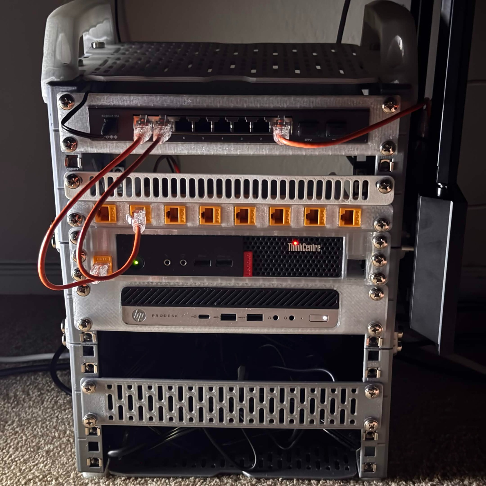
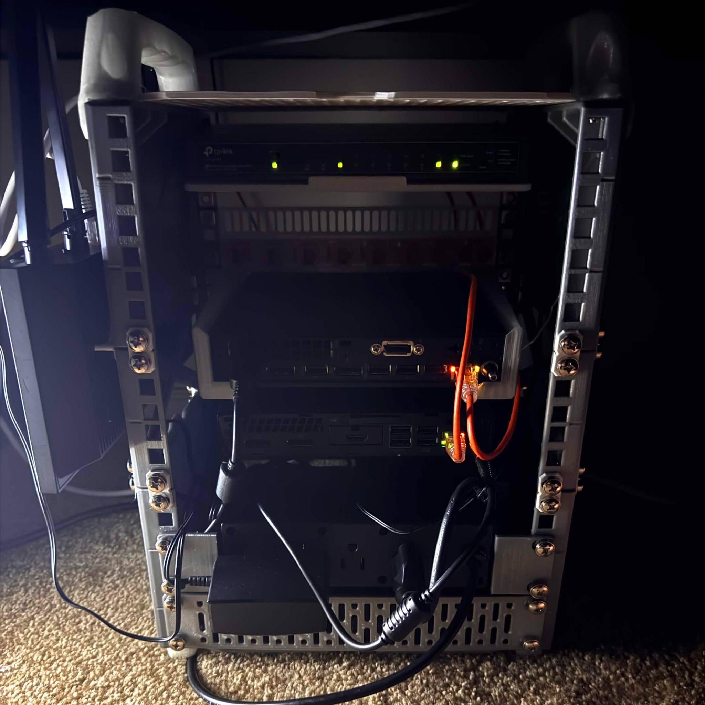

# Personal Homelab Infrastructure 
A personal homelab focused on self-hosted services, network management, device uptime. 

## Pictures of the Network Rack

Current physical rack setup as of **August 8, 2026**.

## Hardware

### Compute
- **HP ProDesk 600 G3 Micro** — Proxmox node
- **Lenovo ThinkCentre M710q** — Proxmox node

### Networking
- **TP-Link TL-SG2210P** — managed PoE switch

### Rack & Custom Hardware
- Custom 3D-printed rack components
- Custom equipment mounts
- Custom cable-management components

## 3D Printing
I design items using CAD software and print custom components for the homelab and publish selected models on MakerWorld.

[View the 3D Models →](3d-models.md)

## Documentation
This site will grow alongside the homelab.

- [Hardware](hardware.md)
- [3D Models](3d-models.md)

More documentation will be added as the infrastructure develops.
